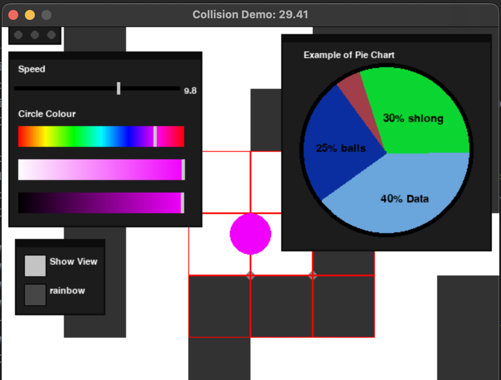

# GEWY
Basic, light-weight Imperative GUI library for pygame

Requires VOBJ.py to work

<!--  -->

# Features:
 - Buttons
 - Variable Sliders
 - Colour Sliders
 - Pie Charts
 - Tab System
 - Moveable windows
 - Window heirarchy system
